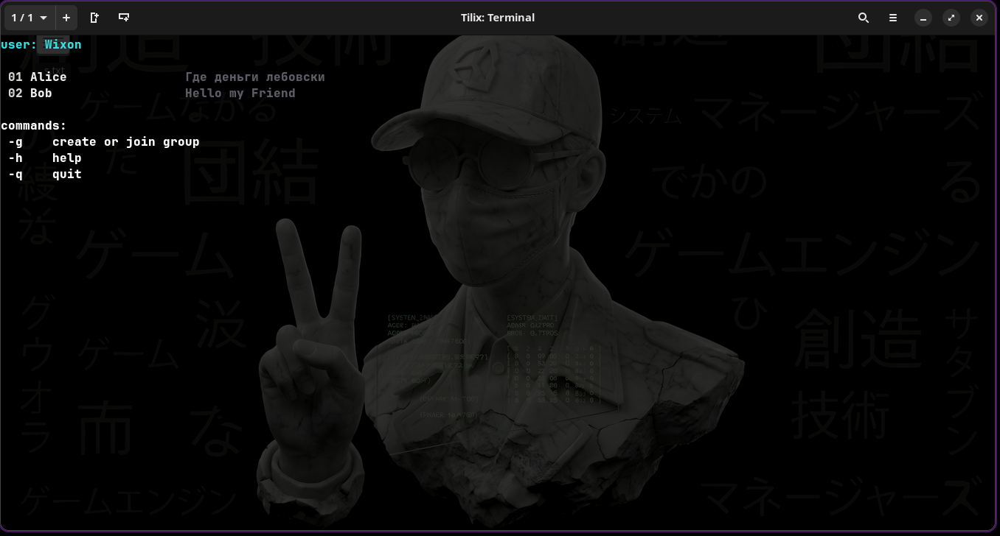
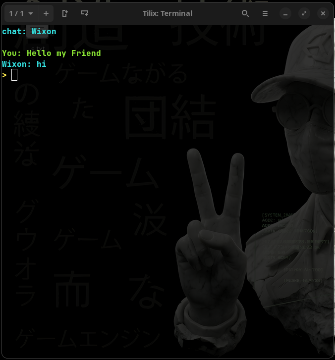
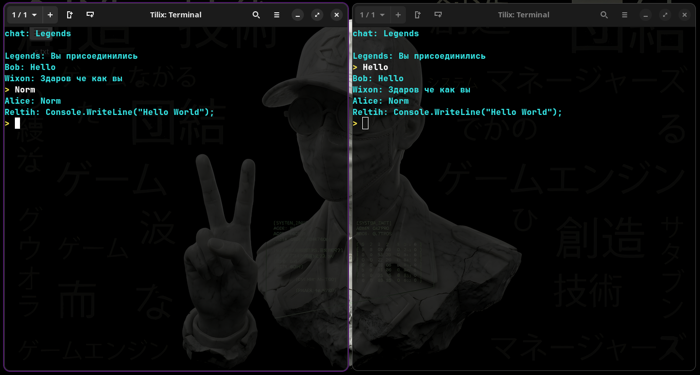

# SocketChat

**SocketChat** — небольшой консольный чат на **.NET 9** и **WebSockets**.

Проект состоит из сервера и клиента: авторизация по нику, личные сообщения, групповые чаты и история переписки — всё в минималистичном терминальном интерфейсе.

---

## ✨ Возможности

- авторизация по имени пользователя;
- личные сообщения;
- групповые чаты;
- история переписки;
- консольное меню и экран чата;
- keep-alive / ping для стабильного соединения.

---

## 🛠️ Стек

- **.NET 9**
- **ASP.NET Core**
- **WebSockets**
- бинарный протокол обмена сообщениями

---

## 🚀 Запуск

### Сервер

    dotnet run --project SocketChatServer

### Клиент

    dotnet run --project SocketChatClient

> По коду клиент ожидает сервер на `https://localhost:5000`, а WebSocket-канал — на `wss://localhost:5000/nf_chat`.

---

## 🎮 Управление

### В меню

- `-g`, `--group` — создать или войти в группу
- `-h`, `--help` — показать помощь
- `-q`, `--quit` — выйти
- `[номер]` — открыть чат из списка
- `[адрес]` — открыть чат по имени

### В чате

- `-h`, `--help` — показать помощь
- `-q`, `--quit` — вернуться в меню
- обычный текст — отправить сообщение

---

## 📸 Скриншоты

### Меню

### Чат

### Группа

---

## 📂 Кратко о структуре

- `SocketChatServer/` — сервер авторизации, WebSocket и доставки сообщений;
- `SocketChatClient/` — консольный клиент с состояниями и историей чатов.